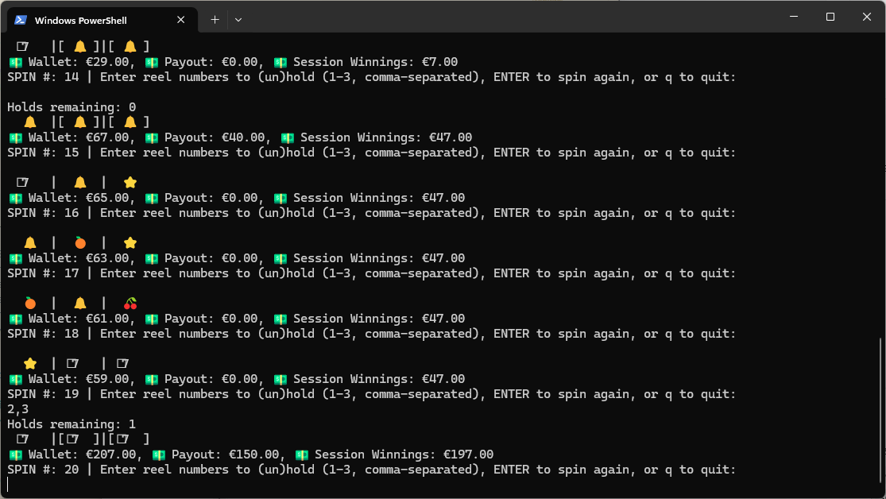
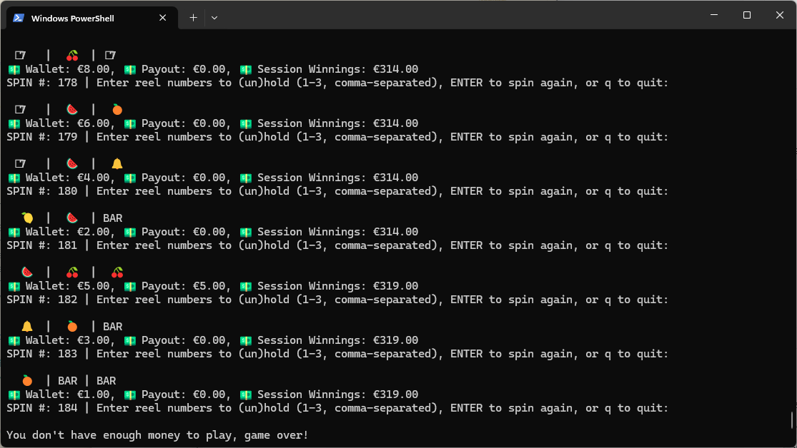
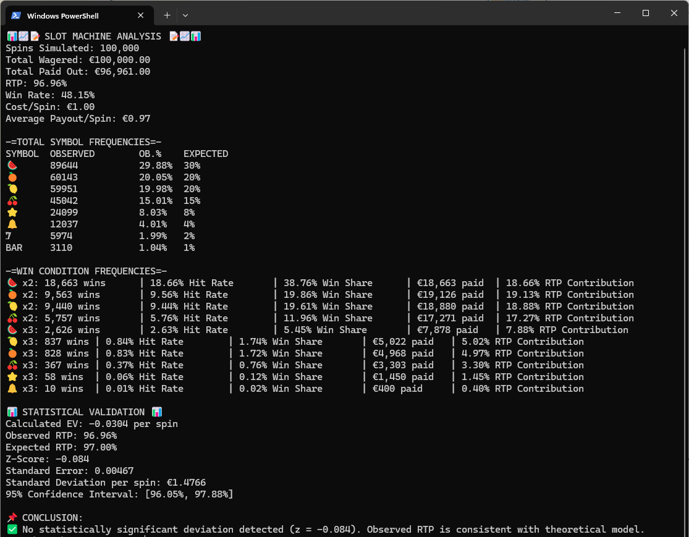

# 🎰 Python Slot Machine

A fully custom terminal-based slot machine built in Python featuring weighted reels, hold mechanics, payout logic, and statistical simulation tools.

---

## Features

- 🎲 **Weighted Reel System**  
  Customisable reel weights allow realistic probability balancing and RTP tuning.

- 🔒 **Hold Mechanic**  
  Players can hold reels strategically between spins, with anti-abuse logic to prevent infinite hold exploitation.

- 💰 **Dynamic Payout System**  
  Symbol-based payout table supporting:
  - Low-tier fruit payouts for 2+ matches
  - High-tier jackpot symbols requiring 3 matches

- 📊 **Monte Carlo Analysis Tool**  
  Includes simulation engine to analyse:
  - RTP (Return To Player)
  - Win Rate / Hit Rate
  - Symbol Frequency Distribution
  - RTP Contribution by Win Type

- 🌐 **Flask API Backend**
  Experimental backend endpoints for integrating slot spins into web applications.

---

## Project Structure

```bash
slot-machine/
│
├── slots.py        # Main slot machine gameplay logic
├── settings.py     # Configurable weights, symbols and payout tables
├── analysis.py     # Statistical simulation / RTP analysis tool
├── app.py          # Flask API backend prototype
└── screenshots/    # Gameplay + analysis screenshots
```

---

## Recent Updates

### Codebase Improvements
- Refactored `slots.py` to improve readability and separate gameplay logic more cleanly.
- Improved hold-state management and win-condition tracking.
- Added better structured helper methods for payout / win checking.

### Probability Balancing
- Reworked reel weighting values in `settings.py` for more realistic slot odds and smoother RTP balancing.

### Statistical Validation & Expected Value Analysis
- In addition to Monte Carlo simulation, this project now includes a formal statistical validation layer to evaluate whether the slot machine behaves consistently with its intended probability model.

- 🎯 Expected Value (EV) Analysis

- The Expected Value represents the theoretical average profit or loss per spin.

- This allows us to measure whether the slot machine is profitable or loss-making in the long run.

- EV < 0 → House edge (expected in real casino systems)
- EV = 0 → Fair game (theoretical balance point)
- EV > 0 → Player advantage (model imbalance or exploit risk)

- 📊 RTP vs EV Relationship

- Return To Player (RTP) and Expected Value are directly linked:

- EV=RTP−1

- This means:

- RTP expresses return as a ratio
- EV expresses return as net profit per spin

- Both are used to validate whether the simulation matches the intended payout design.

## 📉 Z-Test RTP Validation

- A one-sample z-test is used to compare simulated RTP against the expected theoretical RTP.

- This checks whether observed differences are statistically significant or just random variation.

- Null hypothesis: observed RTP = expected RTP
- Alternative hypothesis: RTP deviates significantly
 - Output includes:
 - Z-score
 - 95% confidence interval
 - Statistical conclusion (pass/fail consistency check)


---

## Screenshots

### Gameplay Example



### Statistical Analysis Output


---

## 🛠️ Future Improvements

* Link in to my more solid random number generator project
* 🔊 Sound effects
* 🎰 Animated/timed reel-strip implementation
* Add endpoints for holding reels to the api version ( /hold )
* Add player sessions (currently only a single shared game state)
* Build a frontend (web UI) to interact with the API

---

## 📜 License

This project is open source and available under the MIT License.

---

## 🙌 Acknowledgements

Built as a learning project to explore:

* Python OOP design
* Randomness and probability
* Game logic implementation
* Z-Test and T-Test pracice
